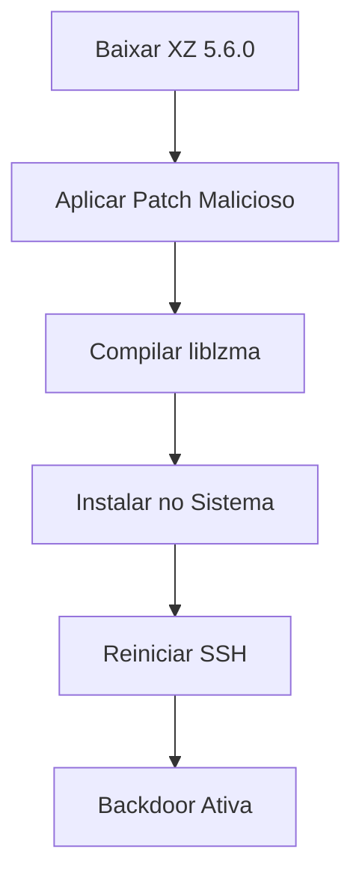

# xzdoor-poc

[](https://opensource.org/licenses/MIT)

Este repositório contém um **proof of concept (POC)** didático para demonstrar a vulnerabilidade de backdoor descoberta no XZ Utils (versão 5.6.0). O script `xzdoor.sh` simula a instalação de uma backdoor na biblioteca liblzma, que pode ser explorada para execução remota de código via SSH.

**Aviso Importante:** Este repositório é destinado **exclusivamente para uso em ambientes controlados e autorizados**, como laboratórios de segurança ou estudos acadêmicos. O autor não se responsabiliza por quaisquer danos, perdas ou consequências decorrentes do uso deste código por terceiros. **Não use em produção ou sistemas reais!**

## 📋 Descrição

O XZ Utils é uma biblioteca de compressão amplamente usada no Linux. Em 2024, foi descoberta uma backdoor nas versões 5.4.6 a 5.6.1, inserida por um maintainer comprometido. Esta backdoor permite execução remota de código quando o XZ é usado pelo OpenSSH.

Este POC recria o processo de instalação da backdoor de forma controlada, permitindo estudo e análise forense.

## 🔧 Como Funciona

O script `xzdoor.sh` é uma ferramenta CLI interativa que guia o usuário pelas etapas para:

1. **Baixar** o código-fonte oficial do XZ Utils (versão 5.6.0).
2. **Aplicar** um patch malicioso ao arquivo `crc64_fast.c`, que insere código shell reverso.
3. **Compilar** as bibliotecas liblzma (estática e compartilhada).
4. **Instalar** sobrescrevendo a liblzma do sistema.
5. **Reiniciar** serviços como SSH para ativar a backdoor.
6. **Opcionalmente**, gerar um pacote .deb falso para distribuição.

A backdoor funciona interceptando conexões SSH e executando comandos remotos quando uma chave específica é usada.

### Fluxograma do Processo



## 📋 Pré-requisitos

- Sistema Linux (Ubuntu, Debian, Fedora, etc.)
- Acesso root (sudo)
- Ferramentas de compilação: `build-essential`, `autoconf`, `libtool`, `gcc`, `make`
- `wget`, `xz-utils`, `checkinstall`
- Ambiente virtualizado ou container (recomendado para segurança)

## 🚀 Uso

1. Clone o repositório:
   ```bash
   git clone https://github.com/Gabryel-lima/xzdoor-poc.git
   cd xzdoor-poc
   ```

2. Torne o script executável:
   ```bash
   chmod +x xzdoor.sh
   ```

3. Execute como root:
   ```bash
   sudo ./xzdoor.sh
   ```

4. Siga o menu interativo para instalar a backdoor passo a passo.

### Menu de Opções

- **1) Baixar e extrair tarball oficial XZ**: Faz download e extração do código-fonte.
- **2) Aplicar patch malicioso**: Modifica `crc64_fast.c` com código malicioso.
- **3) Compilar bibliotecas**: Gera `liblzma.so` e `liblzma.a`.
- **4) Instalar sobrescrevendo liblzma**: Substitui a biblioteca do sistema.
- **5) Reiniciar SSH e verificar backdoor**: Ativa e testa a backdoor.
- **6) Gerar arquivo .deb falso**: Cria pacote para distribuição (opcional).
- **7) Sair**: Encerra o script.

## ⚠️ Avisos de Segurança

- **Nunca execute em produção**: Pode comprometer sistemas reais.
- **Use em VMs isoladas**: Recomenda-se Docker, VirtualBox ou KVM.
- **Monitore logs**: Verifique `/var/log/auth.log` e `/var/log/syslog`.
- **Desinstale após uso**: Remova a biblioteca modificada e reinstale a oficial.

## 📝 Licença

Este projeto está licenciado sob a Licença MIT. Veja o arquivo [LICENSE](LICENSE) para mais detalhes.

---

**Nota:** Este POC é baseado em análises públicas da vulnerabilidade CVE-2024-3094. Use apenas para educação e pesquisa de segurança.
