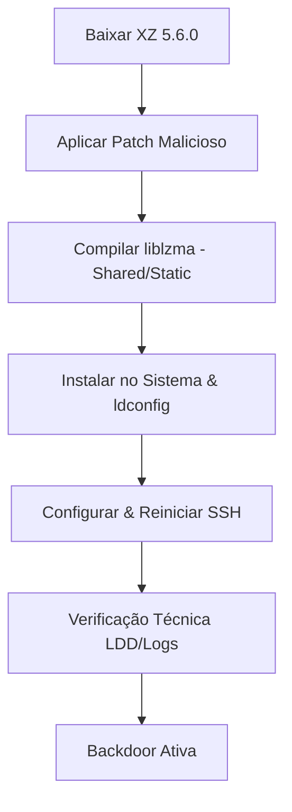

# xzdoor-poc

[](https://opensource.org/licenses/MIT)

Este repositório contém um **proof of concept (POC)** didático para demonstrar a vulnerabilidade de backdoor descoberta no XZ Utils (versão 5.6.0). O script `xzdoor.sh` simula a instalação de uma backdoor na biblioteca liblzma, que pode ser explorada para execução remota de código via SSH.

**Aviso Importante:** Este repositório é destinado **exclusivamente para uso em ambientes controlados e autorizados**, como laboratórios de segurança ou estudos acadêmicos. O autor não se responsabiliza por quaisquer danos, perdas ou consequências decorrentes do uso deste código por terceiros. **Não use em produção ou sistemas reais!**

## 📋 Descrição

O XZ Utils é uma biblioteca de compressão amplamente usada no Linux. Em 2024, foi descoberta uma backdoor nas versões 5.4.6 a 5.6.1, inserida por um maintainer comprometido. Esta backdoor permite execução remota de código quando o XZ é usado pelo OpenSSH.

O script `xzdoor.sh` é uma ferramenta CLI interativa que guia o usuário pelas etapas para:

1. **Baixar** o código-fonte oficial do XZ Utils.
2. **Aplicar** um patch malicioso ao arquivo `crc64_fast.c`.
3. **Compilar** as bibliotecas liblzma (estática e compartilhada).
4. **Instalar** sobrescrevendo a liblzma do sistema.
5. **Configurar e Reiniciar** o servidor SSH (`sshd`).
6. **Verificação técnica** via `ldd` e inspeção de logs.
7. **Opcionalmente**, gerar um pacote `.deb` falso.
8. **Forçar SSH com LD_PRELOAD (Modo PoC)**: Útil se o seu SSH não carregar a liblzma nativamente (ex: distros modernas). Roda o SSH na porta **2222**.
9. **Configuração Automática (Full Chain)**: Executa os passos 1 a 5 em sequência.

### Fluxograma do Processo



## 📋 Pré-requisitos

- Sistema Linux (Ubuntu, Debian, Fedora, CentOS, etc.)
- Acesso root (sudo)
- Ferramentas de compilação: `build-essential`, `autoconf`, `libtool`, `gcc`, `make`, `patch`
- `wget`, `xz-utils`, `checkinstall`, `openssh-server`
- Ambiente virtualizado (VM) ou container (Estritamente recomendado)

## 🚀 Uso (Máquina Alvo/VM)

1. Clone o repositório e dê permissão:
   ```bash
   git clone https://github.com/Gabryel-lima/xzdoor-poc.git
   cd xzdoor-poc
   chmod +x xzdoor.sh
   ```

2. Execute a instalação automática:
   ```bash
   sudo ./xzdoor.sh
   ```
   Escolha a **Opção 9** para instalar tudo. 
   
3. Inicie o servidor de teste (se o LDD falhar):
   Escolha a **Opção 8**. Isso abrirá o SSH na porta **2222** e configurará o firewall automaticamente.

## ⚔️ Ataque (Máquina Atacante)

1. Use o script de trigger fornecido:
   ```bash
   chmod +x attacker_trigger.sh
   ./attacker_trigger.sh <IP_DA_VM> 2222
   ```

A chave maliciosa (payload) será gerada automaticamente em `/tmp/payload.pub` e enviada durante a conexão.

**Payload POC:**
`AAAAE2VjZS5waHA6Ly8vanVzdC1hLXRlc3QtY2Fsb`
